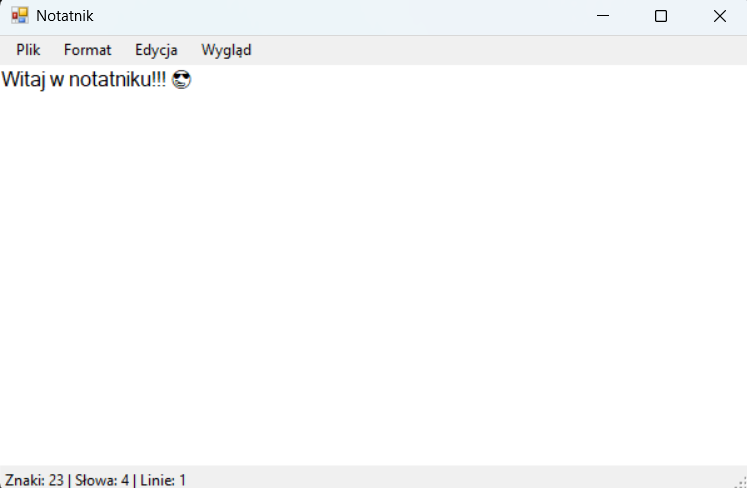
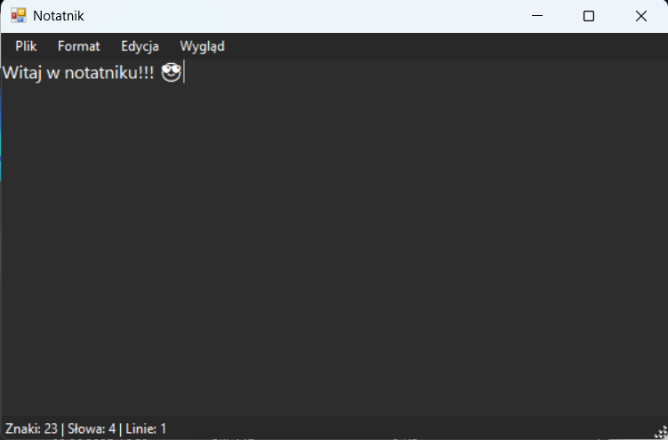
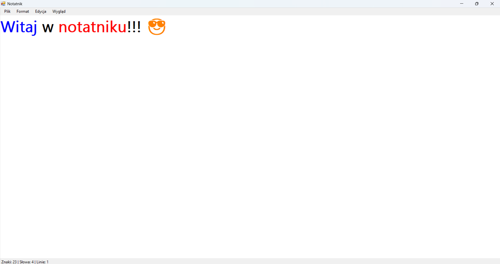

# Notatnik – Aplikacja Windows Forms w C#
## Opis projektu

Notatnik z Emoji to prosta, lecz funkcjonalna aplikacja desktopowa stworzona w języku C# z użyciem Windows Forms. Umożliwia tworzenie i edytowanie plików tekstowych z dodatkowymi funkcjami personalizacji wyglądu, drukowania oraz wstawiania emoji. Projekt został zrealizowany w ramach przedmiotu **Podstawy Programowania**.

## 🎯 Główne funkcje

- 📂 Tworzenie, otwieranie i zapisywanie plików `.txt`
- 🎨 Zmiana czcionki i koloru tekstu
- 🌙 Przełączanie między trybem jasnym i ciemnym
- 🔁 Cofanie i ponawianie zmian
- 🖨️ Podgląd i drukowanie tekstu
- 😀 Wstawianie emoji z osobnego okna
- ℹ️ Licznik znaków, słów i linii w czasie rzeczywistym

## 🖼️ Zrzuty ekranu

## 🚀 Uruchamianie projektu

1. Otwórz projekt w **Visual Studio**.
2. Upewnij się, że ustawiono projekt jako domyślny do uruchomienia (`Form1` jako `StartupForm`).
3. Kliknij **Start** (`F5`) lub skompiluj i uruchom ręcznie.

## 📁 Struktura projektu

- `Form1.cs` – główna forma aplikacji z interfejsem notatnika
- `FormEmoji.cs` – dodatkowe okno do wstawiania emoji
- `Program.cs` – punkt wejścia do aplikacji
- `Designer.cs` – pliki projektowe generowane przez Visual Studio

## 🔧 Technologie

- C#
- Windows Forms (.NET Framework)
- Visual Studio

## ✅ Status

✅ Projekt ukończony i gotowy do użycia.

## 📚 Autor

Projekt stworzony przez **Macieja Ronowskiego** 

---
*Możesz używać, rozwijać i modyfikować ten projekt na własne potrzeby edukacyjne.*
